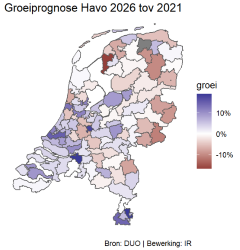

# TutorialKaarten

This is a very short tutorial on how to make maps. It is in Dutch. It helps you make maps like these:



## Installation

#### Preparation:

-   Have an up-to-date R and RStudio
-   Install `devtools` if you do not have that already:

``` r
install.packages("devtools")
```

-   The package assumes you have `tidyverse` installed, so install `tidyverse` if you do not have that already

``` r
install.packages("tidyverse")
```

-   Install `learnr` if you do not have that already:

``` r
install.packages("learnr")
```

#### Install the the package TutorialKaarten itself:

``` r
devtools::install_github("MMJansen/TutorialKaarten")
```

## Running the tutorial

#### Via tutorial pane

-   Navigate to the Tutorial pane of your RStudio IDE (top-right)
-   Click Start Tutorial
-   Wait a bit until the tutorial is ready for use
-   Then click the button with alt-text "Show in new window"

#### Without tutorial pane

-   Run the following code to open the tutorial:

``` r
learnr::run_tutorial("Kaarten", "TutorialKaarten")
```

-   Wait a bit until the tutorial is ready for use
-   Click Open in Browser (Show in new window).
